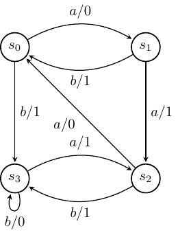
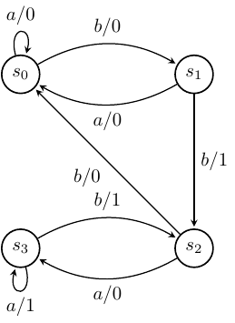

# Finite State Machine Testing – Sample Solutions

## Example FSMs

In the exercises, we will use two FSMs. Both have input alphabet
$X = \{a,b\}$ and output alphabet $Y = \{0,1\}$. The first FSM will be
called $M_1$ and is represented by the following directed graph.

The second, called $M_2$, is represented by the following directed
graph.

In both cases, $s_0$ is the initial state.

## Exercises

For each FSM $M_i$ given above:

1.  Determine the resulting state and the output produced after taking $abbab$ as input.
2.  For every state $s$, find a set of input sequences $V$ (state cover) that takes the FSM from its initial state $s_0$ to state $s$.
3.  Derive a transition tour.
4.  Determine whether there is a Unique Input Output Sequence (UIO) for each state.
5.  Find a characterising set $W$.
6.  Apply the W-method (no extra states).

## Sample Solutions

### Answers for $M_1$

1.  The resulting state is given by  $\delta^*(s_0,abbab)$ and the output is given by  $\lambda^*(s_0,abbab)$:

    $$\begin{aligned}\delta^*(s_0,abbab) & = \delta^*(\delta(s_0,a),bbab) \\
    & =  \delta^*(s_1,bbab) \\
    & =  \delta^*(\delta(s_1,b),bab) \\
    & =  \delta^*(s_0,bab) \\
    & =  \delta^*(\delta(s_0,b),ab) \\
    & =  \delta^*(s_3,ab) \\
    & =  \delta^*(\delta(s_3,a),b) \\
    & =  \delta^*(s_2,b) \\
    & =  \delta^*(\delta(s_2,b),\epsilon) \\
    & =  \delta^*(s_3,\epsilon) \\
    & = s_3\end{aligned}$$

    $$\begin{aligned}\lambda^*(s_0,abbab) & = \lambda(s_0,a) \lambda^*(\delta(s_0,a),bbab) \\
    & = 0  \lambda^*(s_1,bbab) \\
    & =  0 \lambda(s_1,b)  \lambda^*(\delta(s_1,b),bab) \\
    & =  0 1 \lambda^*(s_0,bab) \\
    & =  0 1 \lambda(s_0,b) \lambda^*(\delta(s_0,b),ab) \\
    & =  0 1 1  \lambda^*(s_3,ab) \\
    & =  0 1 1 \lambda(s_3,a) \lambda^*(\delta(s_3,a),b) \\
    & =  0 1 1 1 \lambda^*(s_2,b) \\
    & = 0 1 1 1  \lambda(s_2,b) \lambda^*(\delta(s_2,b),\epsilon) \\
    & =  0 1 1 1 1 \lambda^*(s_3,\epsilon) \\
    & = 0 1 1 1 1\end{aligned}$$

2. There are a number of choices for the state cover, including
    $V = \{\epsilon, a, aa, b\}$ This is because $\epsilon$ reaches
    $s_0$, $a$ reaches $s_1$, $b$ reaches $s_3$ and $aa$ reaches $s_2$.

    In this case, the sequences are minimal (they could result from the
    use of a breadth-first search).

3. Transition tours include: $aaaabbbabaa$. To see that this covers
    each transition we can simply trace the behaviour through $M_1$
    getting:

    $$s_0 \xrightarrow{a} s_1 \xrightarrow{a} s_2 \xrightarrow{a} s_0 \xrightarrow{a} s_1
    \xrightarrow{b} s_0 \xrightarrow{b} s_3 \xrightarrow{b} s_3 \xrightarrow{a} s_2 \xrightarrow{b} s_3 \xrightarrow{a} s_2\xrightarrow{a} s_0$$

    To see that this includes each transition we simply need to check
    that for each state $s_i$, each input has been received when $M_1$
    is in state $s_i$

    To check each transition we might use:

    -   Transitions from $s_0$: $\{aba, bb\}$
    -   Transitions from $s_1$: $\{abaa, aaaa\}$
    -   Transitions from $s_2$: $\{aaaaa, aabb\}$
    -   Transitions from $s_3$: $\{ baaa, bbb\}$

4. There are UIOs for each state, including the following.

    | State      | UIO |
    | ----------- | ----------- |
    | $s_0$  |  $a/0\ a/1$ |
    | $s_1$  |  $b/1\ a/0$ |
    | $s_2$  |  $a/0\ a/0$ |
    | $s_3$  |    $b/0$    |

    To see that this is the case, for each UIO we can consider the
    output produced, in response to the input sequence from the UIO, for
    every other state. Consider, for example, the UIO for state $s_1$.
    We get the following:

    |  State  |  Response to $ba$ |
    | ------- | ------------------|
    |  $s_0$  |        $11$ |
    |  $s_1$  |        $10$ |
    |  $s_2$  |        $11$ |
    |  $s_3$  |        $01$ |

    From this, we can see that the output produced from $s_1$ is
    different from that produced from any other state. Thus, to check
    that the FSM is in $s_1$ it is sufficient to input $ba$: if we get
    output $10$ then the FSM (before we applied $ba$) was in state $s_1$
    and otherwise it was in some other state.

    Note: from the above table we can see that $ba$ also defines a UIO
    for state $s_3$, however the shorter sequence $b$ also gives a UIO
    for $s_3$.

5. There are a number of possible characterising sets, including one
    defined by the UIOs. A smaller example is $W = \{aa,b\}$.

6.  Applying the W-Method, we use: $V = \{\epsilon, a, aa, b\}$,
    $W = \{aa,b\}$. We therefore obtain the following:

    $$\{\epsilon, a, aa, b\} \{a,b\} \{aa,b\}$$

    We can expand this out to get:

    $$\{
    aaa, ab, baa, bb, aaaa, aab, abaa, abb, aaaaa, aaab, aabaa, aabb, baaa, bab, bbaa, bbb
    \}$$

    (Alternative) Applying the W-Method, we use: $V = \{\epsilon, a, aa, b\}$,
    $W = \{a,b\}$. We therefore obtain the following:

    $$\{\epsilon, a, aa, b\} \{a,b\} \{a,b\}$$

    We can expand this out to get:

    $$\{
    aa, ab, ba, bb, aaa, aab, aba, abb, aaaa, aaab, aaba, aabb, baa, bab, bba, bbb
    \}$$

### Answers for $M_2$

1.  The resulting state is given by  $\delta^*(s_0,abbab)$ and the output is given by  $\lambda^*(s_0,abbab)$:

    $$\begin{aligned}
    \delta^*(s_0,abbab) & = \delta^*(\delta(s_0,a),bbab) \\
     & =  \delta^*(s_0,bbab) \\
     & =  \delta^*(\delta(s_0,b),bab) \\
     & =  \delta^*(s_1,bab) \\
     & =  \delta^*(\delta(s_1,b),ab) \\
     & =  \delta^*(s_2,ab) \\
     & =  \delta^*(\delta(s_2,a),b) \\
     & =  \delta^*(s_3,b) \\
     &  =  \delta^*(\delta(s_3,b),\epsilon)  \\
     & =  \delta^*(s_2,\epsilon) \\
     & = s_2
    \end{aligned}$$

    $$\begin{aligned}
    \lambda^*(s_0,abbab) & = \lambda(s_0,a) \lambda^*(\delta(s_0,a),bbab) \\
     & = 0  \lambda^*(s_0,bbab) \\
     & =  0 \lambda(s_0,b)  \lambda^*(\delta(s_0,b),bab) \\
     & =  0 0 \lambda^*(s_1,bab) \\
     & =  0 0 \lambda(s_1,b) \lambda^*(\delta(s_1,b),ab) \\
     & =  0 0 1  \lambda^*(s_2,ab) \\
     & =  0 0 1 \lambda(s_2,a) \lambda^*(\delta(s_2,a),b) \\
     & =  0 0 1 0 \lambda^*(s_3,b) \\
     &  = 0 0 1 0  \lambda(s_3,b) \lambda^*(\delta(s_3,b),\epsilon)  \\
     & =  0 0 1 0 1 \lambda^*(s_3,\epsilon) \\
     & = 0 0 1 0 1
    \end{aligned}$$

2.  State cover: $V = \{\epsilon, b, bb, bba\}$. Again, this set is minimal (same reason).

3.  Transition tours include: $ababbaabb$

    To check each transition we might use:

    -   Transitions from $s_0$: $\{ab, aaa, bb, baa\}$
    -   Transitions from $s_1$: $\{bab, baaa, bbb, bbaa\}$
    -   Transitions from $s_2$: $\{bbab, bbaaa, bbbb, bbbaa\}$
    -   Transitions from $s_3$: $\{bbaab, bbaaaa, bbabb, bbabaa\}$

4.  There is no UIO for state $s_1$. To see this, let us suppose that
    there was a UIO for $s_1$. We find the following.

    -   This UIO cannot start with input $a$ since transitions with
        $a/0$ leave $s_0$ and $s_1$ and end at the same state (i.e. such
        a UIO could not distinguish $s_0$ from $s_1$ and thus could not
        be a UIO for $s_1$).

    -   This UIO cannot start with input $b$ since transitions with
        $b/1$ leave $s_3$ and $s_1$ and end at the same state (i.e. such
        a UIO could not distinguish $s_3$ from $s_1$ and thus could not
        be a UIO for $s_1$).

    Both cases lead to a contradiction and so the assumption, that there
    is a UIO for $s_1$, must be false.

5.  Characterising set: $W=\{b,aa\}$

    To see that this is a characterising set, it is sufficient to
    consider the output produced, from each state, in response to both b
    and aa and see that this pair of values identifies each state.

    | State   | Response to $b$   | Response to $aa$   |
    | ------- | ----------------- |  ------------------|
    | $s_0$   |       $0$         |      $00$          |
    | $s_1$   |       $1$         |      $00$          |
    | $s_2$   |       $0$         |      $01$          |
    | $s_3$   |       $1$         |      $11$          |

6.  Applying the W-Method, we use $\{\epsilon, b, bb, bba\}$ and $W=\{b,aa\}$.

    We therefore obtain: $\{\epsilon, b, bb, bba\} \{a, b\} \{b,aa\}$

    We can expand this out to:

    $$\{
    % starting with \epsilon
    ab, aaa, bb, baa,
    % starting with b
    bab, baaa, bbb, bbaa,
    % starting with bb
    bbab, bbaaa, bbbb, bbbaa,
    %starting with bba
    bbaab, bbaaaa, bbabb, bbabaa
    \}$$

