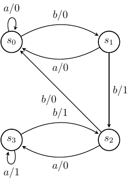

# Finite State Machine Testing

## Example FSMs

In the exercises, we will use two FSMs. Both have input alphabet
$X = \{a,b\}$ and output alphabet $Y = \{0,1\}$. The first FSM will be
called $M_1$ and is represented by the following directed graph.

The second, called $M_2$, is represented by the following directed
graph.

In both cases, $s_0$ is the initial state.

## Exercises

For each FSM $M_i$ given above:

1.  Determine the resulting state and the output produced after taking $abbab$ as input.
2.  For every state $s$, find a set of input sequences $V$ (state cover) that takes the FSM from its initial state $s_0$ to state $s$.
3.  Derive a transition tour.
4.  Determine whether there is a Unique Input Output Sequence (UIO) for each state.
5.  Find a characterising set $W$.
6.  Apply the W-method (no extra states).
