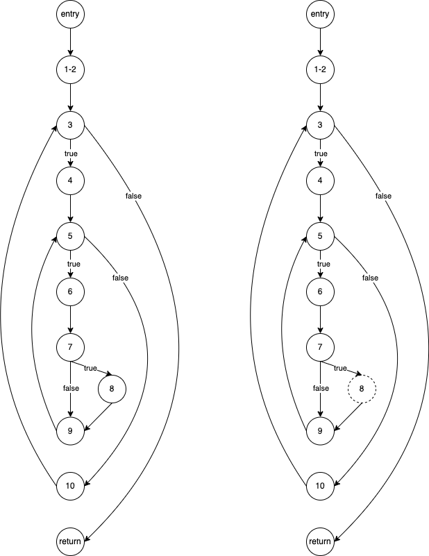

# Regression Testing - Answers

We will use the following scenario.

Let us suppose that a program $p$ under test has ten branches, denoted $b_1 \ldots b_{10}$.

Further, suppose that there is a regression test suite $T$ that contains six test cases, $t_1 \ldots t_6$ such that:

- The execution with $t_1$ leads to the following branches being covered: $b_1, b_3, b_7$.
- The execution with $t_2$ leads to the following branches being covered: $b_2, b_5, b_7$.
- The execution with $t_3$ leads to the following branches being covered: $b_1, b_4, b_8, b_{10}$.
- The execution with $t_4$ leads to the following branches being covered: $b_2, b_6, b_9, b_{10}$.
- The execution with $t_5$ leads to the following branches being covered: $b_2, b_5, b_8, b_9, b_{10}$.
- The execution with $t_6$ leads to the following branches being covered: $b_1, b_4, b_7$.

## Test Suite Minimisation

### Task 1

1. Apply the Greedy Algorithm to the above scenario to produce a reduced test suite that still achieves 100\% branch coverage. Consider whether there is more than one possible test suite that could be returned by the Greedy Algorithm.
2. Apply the Additional Greedy Algorithm to the above scenario to produce a reduced test suite that still achieves 100% branch coverage. At each step, determine the additional coverage provided by each test case not already chosen. Again, consider whether there is more than one possible solution.
3. Apply the algorithm based on uniquely-covered goals proposed by Harrold et al.

#### Sample Solution

##### Greedy Algorithm

The greedy algorithm will follow these steps:
1. $\emptyset$
2. Add test with the highest coverage: {$t_5$}
3. Next, there are two choices with the highest number of covered goals (4): $t_3$ and $t_4$, so we pick either of them, say $t_3$: {$t_5, t_3$}
4. The next obvious candidate is now $t_4$ as it is the only test covering 4 branches: {$t_5, t_3, t_4$}
5. We now have three tests that cover three branches each, so we pick one of them, say $t_1$:  {$t_5, t_3, t_4, t_1$}. At this step, we get lucky because $t_1$ covers precisely the only remaining uncovered branches $b_3$ and $b_7$. Therefore the algorithm stops and the reduced test suite is {$t_5, t_3, t_4, t_1$}. Had we picked for example $t_2$ or $t_6$ in this step, we would have had to continue for one or two more iterations to achieve full coverage.

The same algorithm can be applied in a more analytical way as follows. First, find out the number of branches covered by each test case: 3, 3, 4, 4, 5, 3 for $t_1 \ldots t_6$, respectively. Thus, there are 12 possible orders in which test cases might be considered, which can be represented by the following:

{$t_5$}{$t_3t_4, t_4t_3$}
{$t_1 t_2 t_6, t_1 t_6 t_2, t_2 t_1 t_6, t_2 t_6 t_1, t_6 t_1 t_2, t_6 t_2 t_1$} (read as: _pick one element from each set_)

Now consider the possible reduced test suites. For all orders, we include $t_5, t_3, t_4$. These cover all branches except for: $b_3$ and $b_7$. Further, $b_3$ is only covered by test case $t_1$, which also covers $b_7$, and so the algorithm will stop once $t_1$ has been added. We therefore obtain the following possible reduced test suites.

- {$t_5, t_3, t_4, t_1$} (smallest)
- {$t_5, t_3, t_4, t_2, t_1$}
- {$t_5, t_3, t_4, t_6, t_1$}
- {$t_5, t_3, t_4, t_2, t_6, t_1$}

##### Additional Greedy

The additional greedy algorithm would also start with the test case $t_5$, as it has the maximum coverage. It then updates the coverage information, to give the number of currently uncovered branches that a remaining test case covers, we get:

- For $t_1$: $b_1$, $b_3$, $b_7$
- For $t_2$: $b_7$
- For $t_3$: $b_1$, $b_4$
- For $t_4$: $b_6$
- For $t_6$: $b_1$, $b_4$, $b_7$

There is now a choice of next test case: $t_1$ or $t_6$. Let us suppose that we choose $t_6$ and so we now have {$t_5, t_6$}.

If we then update the coverage information, to give the number of currently uncovered branches that a test case covers, we get:

- For $t_1$: $b_3$
- For $t_2$: None
- For $t_3$: None
- For $t_4$: $b_6$

At this point, we must include in the reduced test suite both $t_1$ and $t_4$ as they cover different yet-uncovered branches and we must discard $t_2$ and $t_3$, as they would not contribute any additional coverage. The order in which $t_1$ and $t_4$ are added does not matter and the reduced test suite is
{$t_5, t_6, t_1, t_4$}.

##### Harrold et al

Finally, the algorithm by Harrold et al. would proceed as follows:

First, we list the tests that cover each goal:

- $b_1$: $t_1$, $t_3$, $t_6$
- $b_2$: $t_2$, $t_4$, $t_5$
- $b_3$: $t_1$
- $b_4$: $t_3$, $t_6$
- $b_5$: $t_2$, $t_5$
- $b_6$: $t_4$
- $b_7$: $t_1$, $t_2$, $t_6$
- $b_8$: $t_3$, $t_5$
- $b_9$: $t_4$, $t_5$
- $b_{10}$: $t_3$, $t_4$, $t_5$

We look at goals covered by a single test. In this example, we have $b_3$ and $b_6$ therefore we add the covering tests: {$t_1, t_4$}

Next, we discard all the goals that have been covered by the selection to update the list of yet-uncovered goals. For example, we discard $b_2$ because it is covered by $t_4$ and we discard $b_7$ because it has been covered by $t_1$ already. The goals remaining therefore are:

- $b_4$: $t_3$, $t_6$
- $b_5$: $t_2$, $t_5$
- $b_8$: $t_3$, $t_5$

We are left only with goals covered by two tests. Since all of them are covered by the same number of tests, there is no prescription on which one to pick. For instance, let's look at $b_4$, which is covered by two tests $t_3$ and $t_6$. How many of the remaining goals do these tests cover? $t_3$ would cover an additional goal ($b_8$) whereas $t_6$ would not cover more goals, therefore we choose $t_3$ and now have: {$t_1, t_4, t_3$}.

Discarding covered goals again, we are left with only one uncovered goal:

- $b_5$: $t_2$, $t_5$

So we pick either of the covering tests, which leads us to achieving full coverage with two possible solutions: {$t_1, t_4, t_3, t_2$} and {$t_1, t_4, t_3, t_5$}.


## Test Prioritisation

### Task 2

1. Apply the Greedy Algorithm to the above scenario to produce an execution order for the test cases. If there is more than one possible result of the Greedy Algorithm, then list them all.
2. Apply the Additional Greedy Algorithm to the above scenario to produce an execution order for the test cases.

#### Sample Solution

Considering the working above, we obtain:

- All orders represented by the following.

{$t_5$}{$t_3t_4, t_4t_3$}{$t_1 t_2 t_6, t_1 t_6 t_2, t_2 t_1 t_6, t_2 t_6 t_1, t_6 t_1 t_2, t_6 t_2 t_1$}

- Orders: $t_5 t_6 t_1 t_4$ and $t_5 t_6 t_4 t_1$

### Task 3

Consider the orderings you produced in the previous task. Given an ordering of the six test cases, we can look at the coverage provided by the first $n$ test cases, where $1 \leq n \leq 6$.

If either Greedy or Additional Greedy can produce more than one ordering then choose one such ordering to be used in the following.

1. For what lengths (values of $n$) do the orderings provided by Greedy and Additional Greedy produce the same branch coverage?
2. What is the value of $n$ that leads to the largest difference in coverage, and how large is this difference?

#### Sample Solution

For Greedy, consider the following order: $t_5 t_3 t_4 t_2 t_1 t_6$.

The branch coverage provided by prefixes is given by the following:

- $t_5$: 5 branches
- $t_5 t_3$: 7 branches
- $t_5 t_3 t_4$: 8 branches
- $t_5 t_3 t_4 t_2$: 9 branches
- $t_5 t_3 t_4 t_2 t_1$: 10 branches
- $t_5 t_3 t_4 t_2 t_1 t_6$: 10 branches

For Additional Greedy, consider: $t_5, t_6, t_1, t_4$ (but we know that the other ordering will provide the same coverage for each $n$). The branch coverage provided by prefixes is given by the following:

- $t_5$: 5 branches
- $t_5 t_6$: 8 branches
- $t_5 t_6 t_1$: 9 branches
- $t_5 t_6 t_1 t_4$: All 10 branches

In this case, Additional Greedy achieves higher branch coverage for lengths 2 to 4.

## Test Selection

Recall method [`SpringUtils.duplicateLetters`](../code/lib/src/main/java/uk/ac/shef/com3529/stringutils/StringUtils.java) from the first week of the semester, for which you are given the following test suite.

```java
public class AlternativeStringUtilsTest {

    @Test
    public void shouldReturnEmptySet() {
        Set<Character> resultSet = duplicateLetters("");
        assertFalse(resultSet.contains('s'));
    }

    @Test
    public void shouldNotReturnNonRepeatedChar() {
        Set<Character> resultSet = duplicateLetters("bugs");
        assertFalse(resultSet.contains('s'));
    }

    @Test
    public void shouldReturnRepeatedChar() {
        Set<Character> resultSet = duplicateLetters("software testing");
        assertTrue(resultSet.contains('t'));
    }
}
```

### Task 4

1. Apply a test selection algorithm to decide which test to execute given the statement on line 25 was accidentally changed from `duplicates.add(si);` to `duplicates.clear();`. Which test(s) should be selected?

#### Sample Solution

First, we need to draw the CFG for the original program, and then the one for the modified one:



The difference in node 8 is illustrated with a dashed outline.

Next, we build the edge traversal sequences for each of our tests.

- `shouldReturnEmptySet`: (entry, 1-2), (1-2, 3), (3, return)
- `shouldNotReturnNonRepeatedChar`: (entry, 1-2), (1-2, 3), (3, 4), (4, 5), (5, 6), (6, 7), (7, 9), (9, 5), (5, 10), (10, 3), (3, return)
- `shouldReturnRepeatedChar`: (entry, 1-2), (1-2, 3), (3, 4), (4, 5), (5, 6), (6, 7), (7, 8), (7, 9), (9, 5), (5, 10), (10, 3), (3, return)

We then perform a parallel traversal of the two CFGs, where we observe a difference in the target node when looking at node 7: the statement in node 8 has changed. Therefore, we search the edge traversal sequences of our tests to identify a test that exercises edge (7, 8). The only candidate is `shouldReturnRepeatedChar`.

We complete the parallel traversal without spotting any other differences.

The output of the test selection algorithm therefore contains a single test `shouldReturnRepeatedChar`.

It may seem like a trivial algorithm with such a small example. Browse the module's [source code](../code/lib/src/main/java/) directory and try to find a more challenging example where you can apply the same technique.